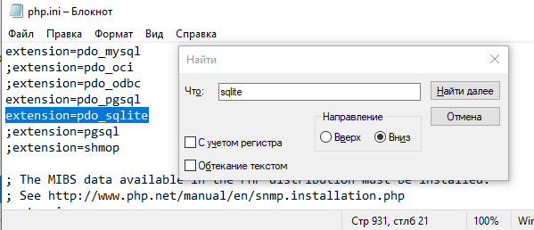

# Работа с SQLite в PHPStorm

### Шаг 0 

Для того что бы работать в php (Laravel) с SQLite, иногда необходимо внести корректировки в конфигурационный файл `php.ini`. Он лежит в корне каталога с PHP. Находим строку `;extension=pdo_sqlite`, раскомментируем (убираем точку с запятой в начале строки) и сохраняем файл.

### Шаг 1 
Для начала, находим справа на панели Database и нажимаем на неё. Под + надо выбрать Data Source -> SQLite

### Шаг 2 
Далее откроется окно с настройками, они будут дефолтные. Выглядеть будут примерно так:

Для полной уверенности можно нажать Test Connection - он покажет нам, работает ли соединение. Также там можно будет посмотреть
опции подключения для PHP кода.

Нажимаем Apply - применить настройки.

### Шаг 3 
У нас теперь открывается отдельный "файлом" консоль для работы с БД SQLite и справа - структура базы данных и таблиц.
Для того, чтобы открыть данные в таблице можно дважды нажать на название таблицы.

В этой консоли можно тренироваться на SQL запросах и наблюдать их результаты в консоли внизу или же в каждой таблице отдельно.
Базу данных, создать, к сожалению, не удастся - зато получится посмотреть результаты работы с таблицами и данными.